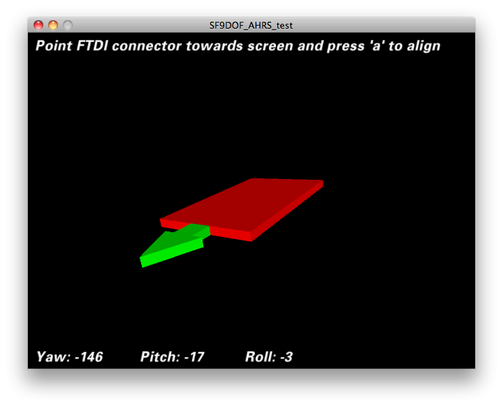

Note
----

This repo provides the ROS driver necessary for the SparkFun 9DoF Razor IMU M0 [SEN-14001](https://www.sparkfun.com/products/14001) to work with ROS. One of the reasons for choosing the Sparkfun 9DoF IMU is that it already has a driver package http://wiki.ros.org/razor_imu_9dof. However the *setup instructions* over there are for an *older version* of the hardware ([SEN-10736](https://www.sparkfun.com/products/retired/10736))

The Razor has an onboard Arduino which runs Attitude Heading Reporting System (AHRS) firmware that works with this ROS driver. ***You have to load the ROS AHRS firmware onto it using the Arduino IDE***. The board as shipped from Sparkfun only contains sensor-value-printing firmware, called the example firmware in the [Sparkfun 9DoF Razor IMU M0 Hookup Guide](https://learn.sparkfun.com/tutorials/9dof-razor-imu-m0-hookup-guide).

The ROS version of the AHRS firmware is in this package, and almost entire code is based on https://github.com/KristofRobot/razor_imu_9dof (***the original repository***). ~~My modifications to the original repo are to ***correct the coordinate system*** so that it follows [REP-103](http://www.ros.org/reps/rep-0103.html), it looks like this (for accelerometer & gyroscope)~~:


**UPDATE**: It turns out IMUs measure acceleration opposite of gravitational acceleration in the static state. Please see these posts:

 1. [IMU convention for robot_localization](https://answers.ros.org/question/269030/imu-convention-for-robot_localization/)
 2. [Why do 3-axis accelerometers seemingly have a left-handed coordinate system?](https://robotics.stackexchange.com/questions/1858/why-do-3-axis-accelerometers-seemingly-have-a-left-handed-coordinate-system)
3. [IMU data to be used with robot_localization](https://answers.ros.org/question/298415/imu-data-to-be-used-with-robot_localization/?answer=298438#post-id-298438)

So the `razor_imu_9dof` package provides data in the right format. ***No changes are required to the code.***
Please see this issue for more details: [KristofRobot#43: Wrong coordinate system for SEN 14001?](https://github.com/KristofRobot/razor_imu_9dof/issues/43#issuecomment-406983411)

More documentation here - https://github.com/KristofRobot/razor_imu_9dof and http://wiki.ros.org/razor_imu_9dof:


Install and Configure ROS Package
---------------------------------
1) Install dependencies:
```
$ sudo apt-get install python-visual
```
2) Download code:

```
$ cd ~/catkin_workspace/src
$ git clone https://github.com/subodh-malgonde/razor_imu_9dof.git
$ cd ..
$ catkin_make
```

Install Arduino firmware
-------------------------
For SEN-14001 (9DoF Razor IMU M0), follow the instructions for the default firmware [9DoF Razor IMU M0 Hookup Guide](https://learn.sparkfun.com/tutorials/9dof-razor-imu-m0-hookup-guide) from section:

1. [Installing the 9DoF Razor Arduino Core](https://learn.sparkfun.com/tutorials/9dof-razor-imu-m0-hookup-guide#installing-the-9dof-razor-arduino-core) to
2. [Libraries and Example Firmware](https://learn.sparkfun.com/tutorials/9dof-razor-imu-m0-hookup-guide#libraries-and-example-firmware).

Next, instead of using the [SparkFun MPU-9250 Digital Motion Processing (DMP) library](https://github.com/sparkfun/SparkFun_MPU-9250-DMP_Arduino_Library), one needs to use the updated version from https://github.com/lebarsfa/SparkFun_MPU-9250-DMP_Arduino_Library/releases (basically the zip file of the latest release).

Next, instead of using the example firmware provided by Sparkfun, use the firmware from this repo. The steps to do this are:

1. Open ``src/Razor_AHRS/Razor_AHRS.ino`` in Arduino IDE. Note: this is a modified version
of Peter Bartz' original Arduino code (see https://github.com/ptrbrtz/razor-9dof-ahrs). 
Use this version - it emits linear acceleration and angular velocity data required by the ROS Imu message

2. Select your hardware here by uncommenting the right line in ``src/Razor_AHRS/Razor_AHRS.ino``, e.g.

<pre>
// HARDWARE OPTIONS
/*****************************************************************/
// Select your hardware here by uncommenting one line!
#define HW__VERSION_CODE 14001 // SparkFun "9DoF Razor IMU M0" version "SEN-14001"
</pre>

3) Upload Arduino sketch to the Sparkfun 9DOF Razor IMU board


Configuration, Launching and Calibration
----------------------------------------
Follow the steps from the [original repository](https://github.com/KristofRobot/razor_imu_9dof) or the [ROS Wiki](http://wiki.ros.org/razor_imu_9dof).

Calibration is very important, otherwise it can lead to wrong yaw measurements as demonstrated in [KristofRobot#43](https://github.com/KristofRobot/razor_imu_9dof/issues/43#issuecomment-406983411). Also see [Troubleshooting: Unstable yaw (aka heading aka azimuth) readings / Yaw drift](https://github.com/Razor-AHRS/razor-9dof-ahrs/wiki/tutorial#unstable-yaw-aka-heading-aka-azimuth-readings--yaw-drift)

Alternative 3D visualization
----------------------------
The original repo uses the package `python-visual` for 3D visualization. This package is not available on Ubuntu 18.04. So I have included a Sketch which can be run using the software [Processing](http://processing.org/). The setup instructions for Processing can be found in the magnetometer calibration section of the [ROS wiki](http://wiki.ros.org/razor_imu_9dof). You can find this sketch in the visualization directory.

- Open the file [Razor_AHRS_test.pde](visualization/Processing/Razor_AHRS_test/Razor_AHRS_test.pde) using Processing.
- In Processing:
  - Go to "Sketch" and hit "Run".
  - The test sketch should now show the movements of the tracker. If not, have a look at the console at the bottom of the Processing code window. It might tell you why it’s not working. Most likely something is wrong with the serial port. At the top of the code you find a description how to set the correct port.

